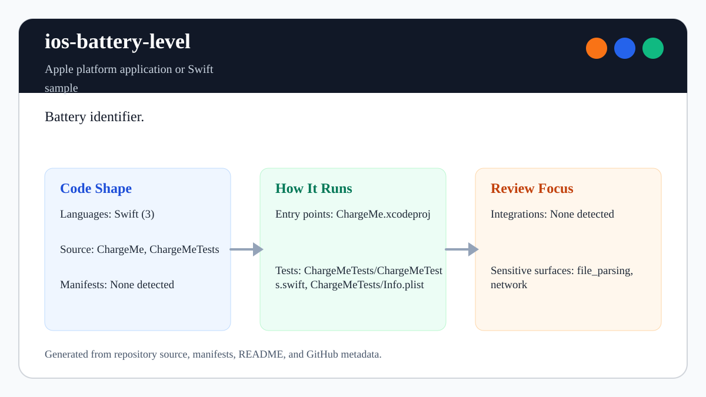

# ios-battery-level

<!-- README-OVERVIEW-IMAGE -->


## Overview

`garethpaul/ios-battery-level` is a Apple platform application or Swift sample. Battery identifier.

This README is based on the checked-in source, manifests, scripts, and repository metadata on the `master` branch. The project language mix found during review was: Swift (3).

## Repository Contents

- `CHANGES.md` - concise history of maintenance changes
- `ChargeMe` - source or example code
- `ChargeMe.xcodeproj` - Xcode project file
- `ChargeMeTests` - source or example code
- `Makefile` - local verification entry point
- `SECURITY.md` - security reporting and disclosure guidance
- `scripts/check-baseline.py` - static iOS battery sample verifier
- `VISION.md` - project direction and maintenance guardrails

Additional scan context:

- Source directories: ChargeMe, ChargeMeTests
- Dependency and build manifests: none detected
- Entry points or build surfaces: `make check`, ChargeMe.xcodeproj
- Test-looking files: ChargeMeTests/ChargeMeTests.swift, ChargeMeTests/Info.plist

## Getting Started

### Prerequisites

- Git
- macOS with Xcode for building Apple platform projects
- Python 3 for local static verification on non-macOS hosts

### Setup

```bash
git clone https://github.com/garethpaul/ios-battery-level.git
cd ios-battery-level
make check
```

The checked-in project has no external dependency manifest. Use Xcode for full builds and `make check` for static verification on hosts without Xcode.

## Running or Using the Project

- Open `ChargeMe.xcodeproj` in Xcode, choose the app or sample scheme, and run it on the matching simulator/device.
- The sample enables `batteryMonitoringEnabled` before reading `UIDevice.batteryLevel`, normalizes unknown negative levels to `nil`, then uses `defer` to restore the previous monitoring state.
- Keep battery/device state local-only; do not add analytics, persistence, or network reporting without a dedicated privacy design.

## Testing and Verification

Run the local static baseline:

```bash
make check
```

The baseline runs `scripts/check-baseline.py`, parses plist/storyboard/project XML, checks the Swift source inventory and testability wiring, verifies that battery monitoring is enabled before reading battery level, confirms unknown levels normalize to `nil`, requires focused XCTest assertions for the normalization helper, verifies restoration afterward with `defer`, and guards against logging, network reporting, upload, or analytics behavior.

For full legacy verification on macOS, use Xcode's test action or `xcodebuild test` with the appropriate scheme and destination.

When the required SDK or runtime is unavailable, use static checks and source review first, then verify on a machine that has the matching platform toolchain.

## Configuration and Secrets

- No required secret or credential file was identified in the repository scan. If you add integrations later, keep secrets out of git.

## Security and Privacy Notes

- Review changes touching network requests, sockets, or service endpoints; examples from the scan include ChargeMe/Info.plist, ChargeMeTests/Info.plist.
- Review changes touching file, media, JSON, XML, CSV, OCR, or data parsing; examples from the scan include ChargeMe/Info.plist, ChargeMeTests/Info.plist.
- Battery and device state are local diagnostic signals. Avoid logging, persisting, uploading, or profiling this data unless the data flow and user consent are documented first.

## Maintenance Notes

- This looks like an Apple platform project or sample. Xcode, Swift, CocoaPods, and deployment target versions may need to match the original project era.
- See `SECURITY.md` for vulnerability reporting and safe research guidance.
- See `VISION.md` for project direction and contribution guardrails.
- Run `make check` before pushing changes to Swift sources, plist/storyboard files, Xcode metadata, battery behavior, or privacy documentation.

## Contributing

Keep changes small and tied to the project that is already present in this repository. For code changes, document the toolchain used, avoid committing generated dependency directories or local configuration, and update this README when setup or verification steps change.
